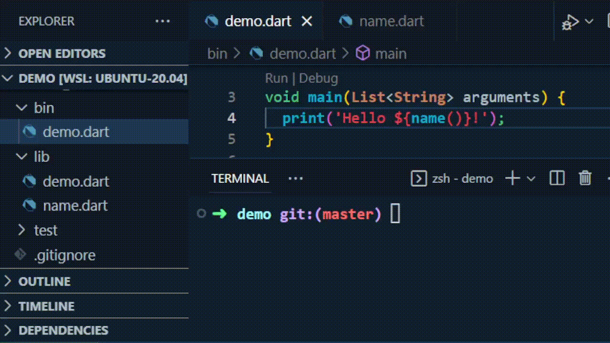

# DartTrack

Application to watch files changes and restart dart script.



## Installation

### With dart pub
You can use it like a global application
```bash
dart pub global activate darttrack
# or
flutter pub global activate darttrack
```

### From source
Also you can compile application from source

```bash
# Clone sources
git clone https://github.com/paveltretyakovru/darttrack.git
cd darttrack

# Compile it to executable file
dart compile exe bin/darttrack.dart -o build/darttrack

# Moving exe file to bin (you can move it to any PATH bin folder)
# /usr/bin/ - work example, but need sudo access to move
sudo mv build/darttrack /usr/bin/
```

## Usage

### Run dart script and restart it (yourscript.dart) when folder (lib) changed

#### Usage variants of the case:
```bash
darttrack ./lib ./bin/yourscript.dart
```

```bash
darttrack --watch ./lib ./bin/yourscript.dart
```

```bash
darttrack --watch ./lib --script ./bin/yourscript.dart
```

```bash
darttrack ./lib --script ./bin/yourscript.dart
```

### Run custom command and restart it (echo test) when folder (lib) changed
#### Usage variants of the case:
```bash
darttrack ./lib --exec "dart test"
```

```bash
darttrack --watch ./lib --exec "dart test"
```